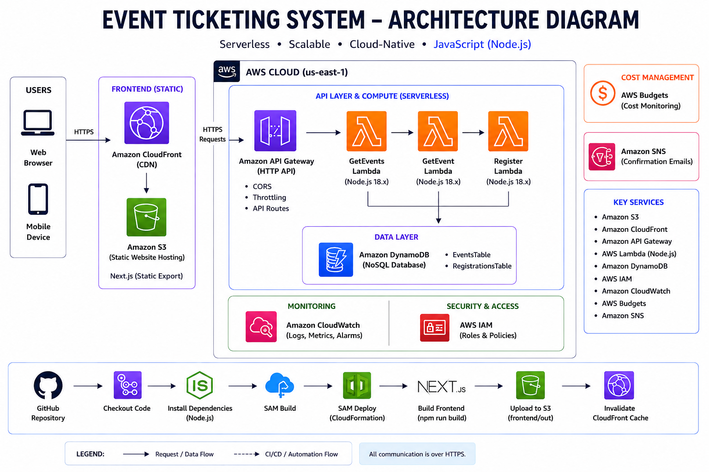

# Event Registration & Ticketing System


The Event Registration & Ticketing System is a cloud-native web application that enables users to browse events, view event details, and register online. The solution replaces manual registration methods such as Microsoft Forms and Excel with a scalable, secure, and serverless architecture on AWS.

The backend is developed using **Node.js 20 AWS Lambda** functions, exposed through **Amazon API Gateway**, and deployed using **AWS Serverless Application Model (AWS SAM)**. The frontend is built with **Next.js**, hosted on **Amazon S3**, and distributed globally using **Amazon CloudFront**.

---

## ✨ Features

- Browse all available events
- View event details
- Register for events
- Prevent duplicate registrations
- RESTful API
- Serverless backend
- Static frontend hosting
- CloudWatch logging and monitoring
- Optional email notifications using Amazon SNS
- CI/CD with GitHub Actions

---

## 🏗️ Architecture



```
User
 │
 ▼
CloudFront
 │
 ▼
Amazon S3
(Next.js Frontend)
 │
 ▼
Amazon API Gateway
 │
 ├───────────────┬────────────────┐
 ▼               ▼                ▼
GetEvents    GetEvent      Register
 Lambda       Lambda        Lambda
 │               │              │
 └───────────────┴──────────────┘
                │
                ▼
        Amazon DynamoDB
                │
                ▼
       Amazon CloudWatch

(Optional)

Register Lambda
        │
        ▼
 Amazon SNS Topic
        │
        ▼
Confirmation Email
```

---

## 🛠️ Technology Stack

### Frontend

- Next.js
- React
- TypeScript
- Tailwind CSS
- Axios

### Backend

- Node.js 20
- AWS Lambda
- Amazon API Gateway
- Amazon DynamoDB

### Infrastructure

- AWS SAM
- AWS CloudFormation
- IAM
- Amazon S3
- Amazon CloudFront
- Amazon CloudWatch

### DevOps

- Git
- GitHub
- GitHub Actions

---

## 📂 Project Structure

```
event-registration-ticketing-system/
│
├── frontend/
│   ├── app/
│   ├── components/
│   ├── lib/
│   ├── services/
│   ├── public/
│   ├── styles/
│   └── package.json
│
├── backend/
│   ├── functions/
│   │   ├── getEvents/index.js
│   │   ├── register/index.js
│   │   ├── getRegistrations/index.js
│   │   └── cancelRegistration/index.js
│   │
│   ├── shared/
│   ├── models/
│   ├── repositories/
│   ├── services/
│   ├── config/
│   ├── template.yaml
│   ├── samconfig.toml
│   └── package.json
│
├── docs/
│   ├── api-documentation.md
│   └── deployment-guide.md
│
├── .github/
│   └── workflows/
│       ├── backend.yml
│       └── frontend.yml
│
└── README.md
```

---

## ☁️ AWS Services

| Service | Purpose |
|----------|----------|
| Amazon S3 | Hosts the frontend |
| Amazon CloudFront | CDN for fast content delivery |
| Amazon API Gateway | REST API |
| AWS Lambda | Backend business logic |
| Amazon DynamoDB | Stores events and registrations |
| Amazon CloudWatch | Monitoring and logging |
| CloudWatch Alarms | Operational alerts |
| IAM | Roles and permissions |
| Amazon SNS *(Optional)* | Email notifications |

---

## 📡 API Endpoints

### Get All Events

```
GET /events
```

Returns all available events.

---

### Get Event

```
GET /events/{id}
```

Returns details of a specific event.

---

### Register

```
POST /register
```

Request

```json
{
  "eventId": "001",
  "name": "Susan Seyram Darke",
  "email": "john@example.com"
}
```

Success

```json
{
  "success": true,
  "message": "Registration successful."
}
```

Duplicate Registration

```json
{
  "success": false,
  "message": "You have already registered for this event using this email address."
}
```

---

## 🚀 Getting Started

### Prerequisites

Install:

- AWS CLI
- AWS SAM CLI
- Node.js 20+
- Git

---

### Clone Repository

```bash
git clone https://github.com/Susie288/Capstone-event-ticketing

cd event-registration-ticketing-system
```

---

## 💻 Frontend Setup

```bash
cd frontend

npm install

npm run dev
```

---

## ⚙️ Backend Setup

```bash
cd backend

npm install
```

Build the application

```bash
sam build
```

Run locally

```bash
sam local start-api
```

---

## 🚀 Deployment

Build

```bash
sam build
```

First deployment

```bash
sam deploy --guided
```

Future deployments

```bash
sam deploy
```

---

## 🌐 Deploy Frontend

Build Next.js

```bash
npm run build
```

Export static files

```bash
npm run export
```

Upload to Amazon S3

```bash
aws s3 sync ./out s3://event-ticketing-system-frontendbucket-pnpq7w5qn7jd
```

Invalidate CloudFront

```bash
aws cloudfront create-invalidation \
--distribution-id YOUR_DISTRIBUTION_ID \
--paths "/*"
```

---

## 🔄 CI/CD

GitHub Actions automates:

- Checkout repository
- Install dependencies
- Build frontend
- Build AWS SAM application
- Deploy backend
- Upload frontend to Amazon S3
- Invalidate CloudFront cache

---

## 📊 Monitoring & Observability (Phase 4)

The application incorporates a comprehensive observability suite powered by Amazon CloudWatch:

- **Custom CloudWatch Metrics (`EventTicketingSystem` namespace)**:
  - `ApiRequestCount`: Total API calls grouped by `FunctionName` and `Status` (`Success` vs `Error`).
  - `FailedRegistrations`: Tracks failed event registration attempts with `Reason` dimension (e.g. duplicate email, event sold out, invalid input).
  - `HandlerDuration`: Measures exact execution duration of each Lambda function in milliseconds.
- **CloudWatch Alarms**:
  - `Api5xxErrorAlarm`: Triggers if API 5XX error count reaches 1 in a 5-minute window (> 5% error rate target).
  - `LambdaExecutionErrorAlarm`: Triggers if `RegisterFunction` encounters unhandled errors.
  - `FailedRegistrationsAlarm`: Triggers if failed registration attempts exceed 5 within 5 minutes.
- **Operational Dashboard**:
  - `OperationalDashboard`: Single-pane CloudWatch Dashboard visualizing API Request Volume, Registration Failure Trends, and Lambda Execution Durations.
- **Structured JSON Logging**:
  - Standardized JSON log events via `shared/logger.js` for CloudWatch Logs Insights querying.

---

## 🔒 Security & Optimization (Phase 4)

- **Input Sanitization & Injection Prevention**:
  - HTML tag stripping and whitespace trimming on all text inputs (`shared/validators.js`).
  - UUID format validation for `eventId`.
  - Field length limits (Name: 80 chars, Email: 254 chars, Phone: 20 chars, Path Params: 256 chars).
- **API Gateway Rate Limiting**:
  - Default route throttling configured with `ThrottlingBurstLimit: 100` and `ThrottlingRateLimit: 50` requests/sec to defend against DDoS attacks.
- **Least-Privilege IAM Policies**:
  - Scoped DynamoDB operations per function.
  - Restricted `cloudwatch:PutMetricData` permission for custom metrics.
- **Cost Optimization & AWS Budgets**:
  - `AWS::Budgets::Budget` configured with a $1.00 USD monthly threshold and 80% notification triggers to ensure usage stays strictly within the AWS Free Tier.

## 📚 Documentation

Additional documentation is available in the `docs/` directory.

| Document | Description |
|----------|-------------|
| `api-documentation.md` | REST API reference |
| `deployment-guide.md` | AWS SAM deployment guide |

---

## 🎯 Learning Outcomes

This project demonstrates practical experience with:

- AWS Serverless Architecture
- Infrastructure as Code using AWS SAM
- Amazon API Gateway
- AWS Lambda
- Amazon DynamoDB
- CloudFront & S3 Static Hosting
- CloudWatch Monitoring
- GitHub Actions CI/CD
- REST API Design
- JavaScript / Node.js Backend Development
- Next.js Frontend Development

---

## 👩‍💻 Author

**Susan**

**Web Developer | Aspiring Cloud Engineer**

This project was developed as part of an AWS Cloud Engineering learning journey to demonstrate the design, deployment, and management of a scalable serverless application using modern AWS cloud services and best practices.

